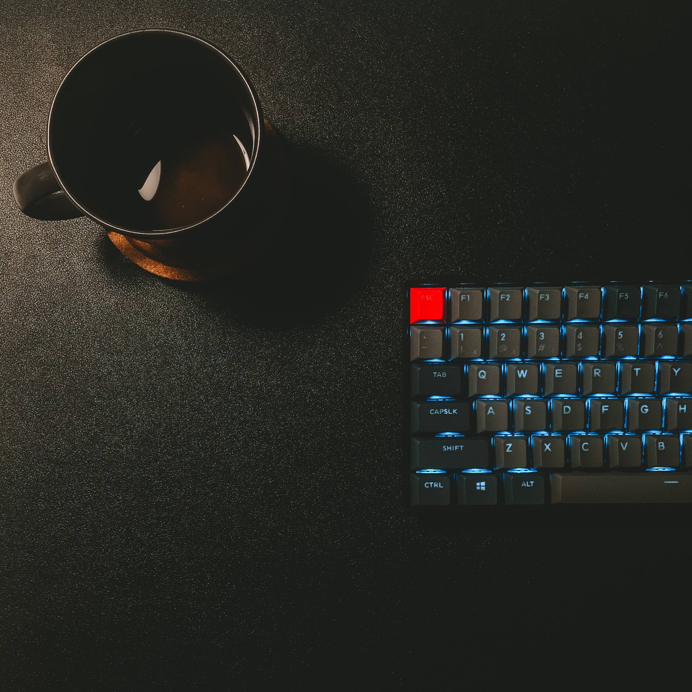
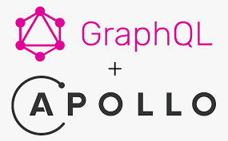

<h1 align='center'>
  Hi there 👋  I'm   <a href="https://tanishkul.github.io/" target="_blank">
  Tanish Kulshrestha</a> 👨‍💻
</h1>

  Fullstack Developer at <a href="https://successive.tech/" target="_blank">Successive Technologies 🚀</a>

 
  &nbsp;&nbsp;
  &nbsp;&nbsp;
  

  

 
 

- 🔭 I’m currently working as a Full Stack developer(MERN).  
  

- 🌱 I’m currently learning Redux.
  

- ❓ Ask me about anything related to MERN stack and related technologies.
  

- ⚡ Fun fact: I use tabs over spaces.
   

## My Skill Set  
<table><tr><td valign="top" width="33%">

### Frontend  

  
  
  
   
  
 
 
  

</td><td valign="top" width="33%">

### Backend  

  
  
  
  
  
 
  
  
  

</td></tr></table>  

   

## Connect with me  

  

  

   

## Github Stats  

  

   

  
